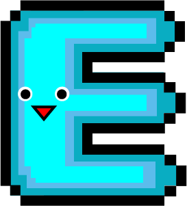
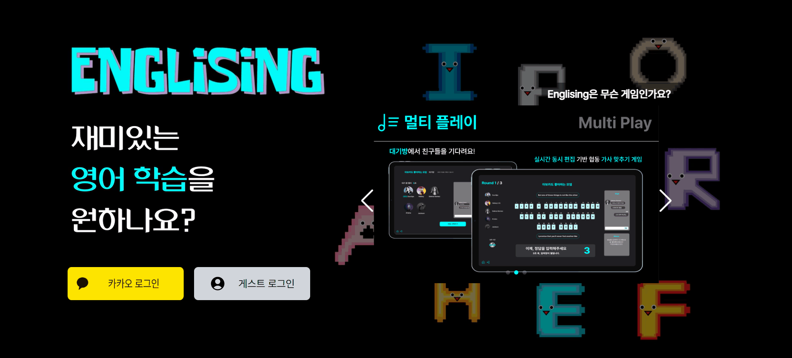
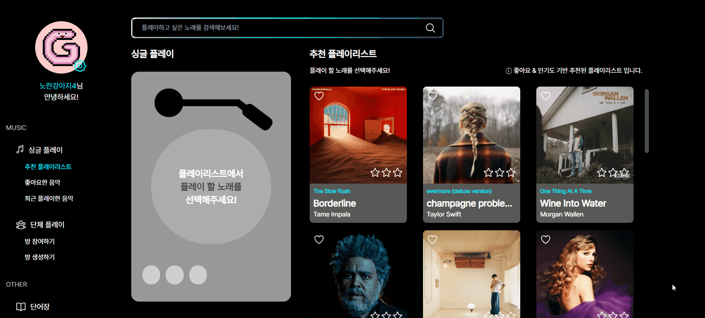
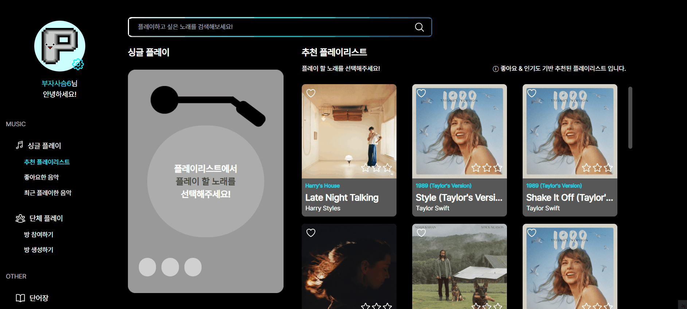
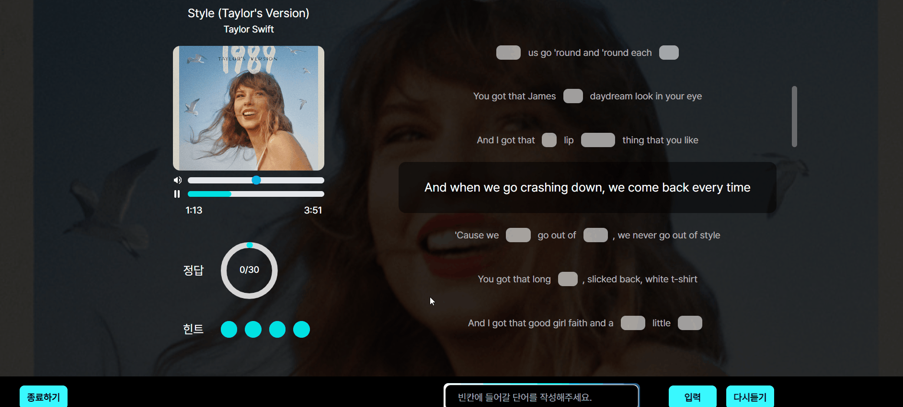
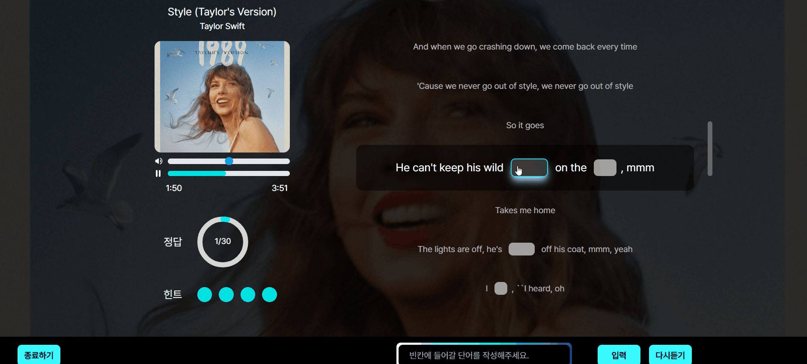
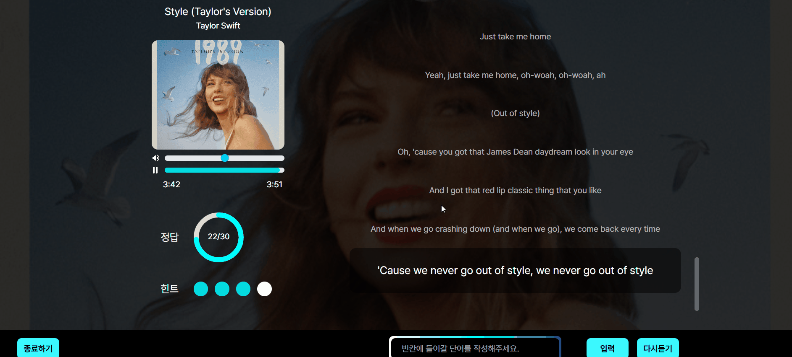
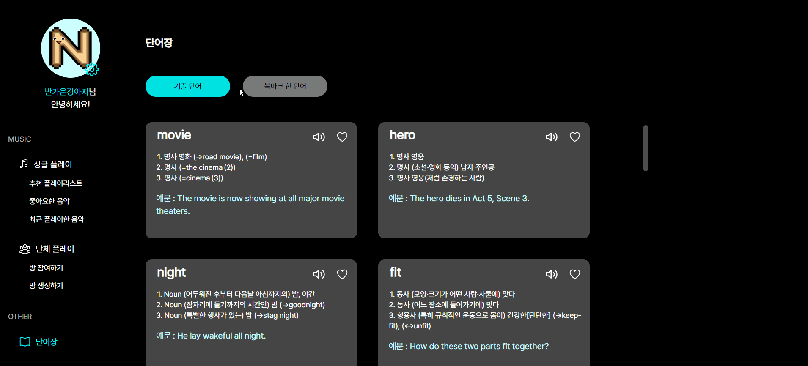
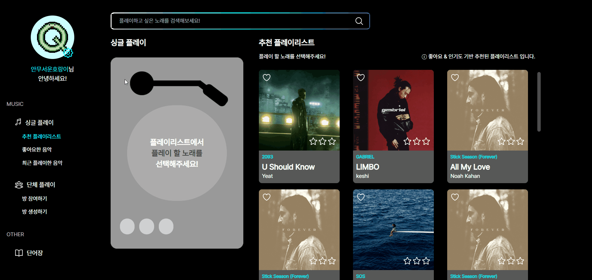

#  영어 공부를 즐겁게 Englising

접속 URL: https://j10a106.p.ssafy.io/

## 💡 프로젝트 소개

> 잉글리싱은 '영어를 더 재밌고 친숙하게 접근할 수는 없을까?'라는 고민에서 시작되었습니다. 다양한 팝송과 게임을 통해 영어에 익숙해져보세요!

- 개발 기간: 2024.02.19 ~ 2024.04.04(약 7주)
- 팀원

| BE     | BE     | BE     | FE     | FE     | FE     |
| ------ | ------ | ------ | ------ | ------ | ------ |
| 고해림 | 김아영 | 이지우 | 김현지 | 손민기 | 최은비 |

&nbsp;

## ✨ 기능 소개

&nbsp;

### 메인 화면

- 카카오 로그인 혹은 게스트 로그인으로 간편하게 로그인 할 수 있어요.

### 싱글 플레이

#### 플레이 리스트

- 추천 플레이 리스트로 사용자의 취향을 분석해서 새로운 노래를 추천해드려요.
- 마음에 드는 노래를 찾으셨나요? 저장한 노래들만 모아서 따로 보여드려요.
- 최근 플레이한 음악에서 이전에 플레이한 노래들을 확인할 수 있어요.

#### 게임 시작

- 사용자의 취향에 따라 난이도를 선택할 수 있어요. 난이도와 사용자의 게임 플레이 이력에 따라 출제되는 단어가 달라집니다.
- 게임이 시작되면 간단한 조작법을 보여줘요.

#### 플레이

- 현재 재생되는 구간의 가사를 하이라이팅 해줍니다.
- 노래를 듣고 답을 입력하면 결과를 바로 확인할 수 있어요. 좌측에선 전체 정답률을 확인할 수 있습니다.
- 현재 구간에 빈 칸이 있는데 답안이 입력되지 않으면 다음 구간으로 넘어가지 않아요. 답을 입력하거나 다음 문장을 직접 클릭해주세요!

- 빈 칸을 누르면 해당 단어를 표준 발음(???)으로 들을 수 있어요.
- 위 기능은 한 플레이에서 최대 4번까지 사용이 가능합니다.

- 게임이 종료되면 결과를 확인할 수 있어요. 전체 가사에서 맞힌 단어, 틀린 단어를 보여줍니다.
- 우측에는 출제된 단어 목록을 보여줍니다. 단어를 클릭하면 단어장에 추가하여 학습에 활용할 수 있어요.

&nbsp;

### 멀티 플레이

#### 대기방

- 방을 만들면 방장이 돼요. 방장만 게임을 시작할 수 있습니다.

#### 플레이

- 게임에 참여한 유저들과 문장을 완성해보세요. 다른 유저가 입력한 내용도 바로바로 볼 수 있어요.
- 채팅으로 의견을 주고 받을 수도 있습니다.
- 답안 작성은 제한된 시간 내에만 가능해요.
- 작성한 답안은 제한 시간이 끝나면 자동으로 제출됩니다. 게임 결과는 라운드마다 확인할 수 있어요.

- 3라운드에서는 힌트가 랜덤으로 하나 제공됩니다.

- 모든 라운드가 끝나면 정답을 확인할 수 있어요.

&nbsp;

### 단어장

- 싱글 플레이에 출제된 단어를 단어장에서 한글 뜻과 예문과 함께 확인할 수 있어요.

&nbsp;

### 프로필 수정

- 랜덤으로 프로필 이미지를 선택할 수 있어요.

&nbsp;

## 💻 기술 소개

### 데이터 게더링

- 게임을 진행하기 위해선 노래 정보, 가사, 단어 등의 데이터가 필요합니다.
- 필요한 데이터들은 각 도커 컨테이너를 통해 개별적으로 수집하도록 자동화하여 지속적으로 수집할 수 있게 설계하였습니다.

### 추천 플레이리스트

- 아이템 기반 추천 알고리즘을 적용하여 사용자의 취향에 기반한 새로운 노래를 추천해줍니다.
- 사용자가 좋아요를 누른 노래 특성을 기반으로 Count Matrix를 생성하고, 코사인 유사도를 계산하여 추천 플레이리스트를 추출합니다.
- 같은 노래가 반복되어 추천되지 않도록 사용자가 최근에 좋아요를 누른 노래 5개의 노래 특성을 분석합니다.
- 좋아요를 누른 노래가 없는 초기 사용자의 경우, 스포티파이의 인기도 및 다른 사용자들의 게임 플레이 횟수에 따른 인기 노래를 선정하여 랜덤으로 추천 플레이리스트를 생성합니다.

### 싱글 플레이 단어 출제

- 싱글 플레이에서 출제되는 단어는 난이도, 사용자 평가 데이터, 사용자 플레이 기록을 기준으로 선정됩니다.
- 사용자가 게임 플레이 전 선택한 난이도에 따라 단어의 길이, 음절 수, 특수 문자 수 등을 기반으로 단어 난이도를 평가합니다.
- 사용자가 북마크한 단어들과 유사도를 비교하여 유사한 단어들이 출제됩니다.
- 사용자의 최근 플레이 기록을 조회하여 유사한 단어가 출제되지 않도록 고려하였습니다.

### 웹소켓

- 여러 명의 참여자가 동시에 같은 게임에 참여하기 때문에 WebSocket을 사용하였습니다.
- 음악 재생 / 라운드 진행 등 서버에서 게임 진행 알림을 전송하면 클라이언트에선 알림을 받아서 게임을 진행합니다.
- 참여자들이 공동의 답안을 작성하기 위해 동시 편집이 가능하도록 구현하였습니다. 한 참여자가 입력한 답안을 WebSocket으로 전송하고, 다른 참여자들은 해당 답안을 수신하여 볼 수 있습니다. 속도가 빠른 Redis 저장소를 이용해 참여자들의 답안을 저장하고 채점합니다.
- 참여자들은 채팅으로 의견을 나눌 수 있습니다. WebSocket Session 연결 시 핸드 쉐이크 과정에서 Cookie로 사용자를 구별하여 채팅에 표시합니다.

&nbsp;

## ⚙ 프로젝트 구조

### 기술 스택

| 분류  | 기술                                                                                                                                                                                                                                                                                                                                                                                                             |
| ----- | ---------------------------------------------------------------------------------------------------------------------------------------------------------------------------------------------------------------------------------------------------------------------------------------------------------------------------------------------------------------------------------------------------------------- |
| BE    |                                                                                                        |
| FE    |     |
| DB    |                                                                                                                                                                                                                      |
| Infra |                                                                                                                  |
